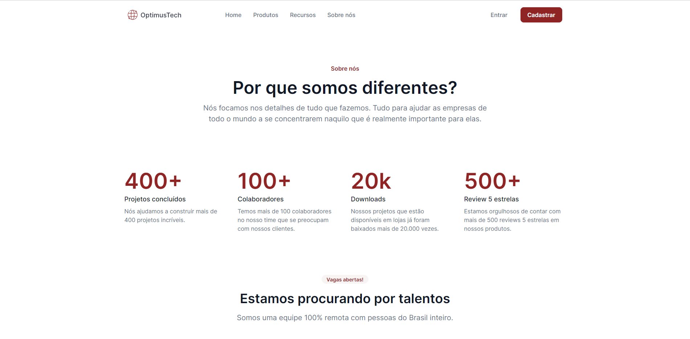

## 🇧🇷 - 7DaysOfCode - Alura

Este é um projeto criado pela 7DaysOfCode para treinamento. Website da empresa fictícia OptimusTech. 

O site conta com uma seção principal, seção de métricas da empresa, seção de "Trabalhe Conosco" + lista com as principais vagas, seção de depoimentos dos colaboradores e o footer com seção de cadastro para receber novas vagas por e-mail.

Este projeto foi desenvolvido com HTML5 e CSS3.

## 🇺🇸 - 7DaysOfCode - Alura

This is a project created by 7DaysOfCode for training. Website of the fictitious company OptimusTech.

The site has a main section, company metrics section, "Work with Us" section + list of the main vacancies, employee testimonials and the footer with registration section to receive new vacancies by e-mail.

This project was developed with HTML5 and CSS3.

## Links

 - ['OptimusTech' in Figma](https://www.figma.com/file/mm3MLozvUDGhDRTxSLlGL5/7daysOfCode-HTML-CSS?node-id=0%3A1&t=ab6r1NbOHffOpABQ-1)
 - [7DaysOfCode](https://7daysofcode.io/)

## Autores

- [Caroline Ferreira - on Instagram](https://www.instagram.com/caferreiraxd/)
- [Caroline Ferreira - on LinkedIn](https://www.linkedin.com/in/caroline-ferreira-837544145/)
